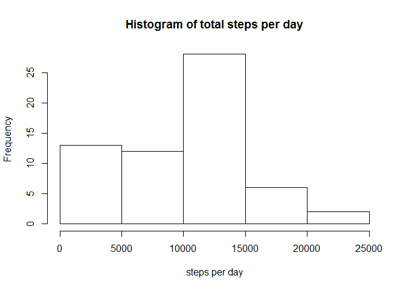
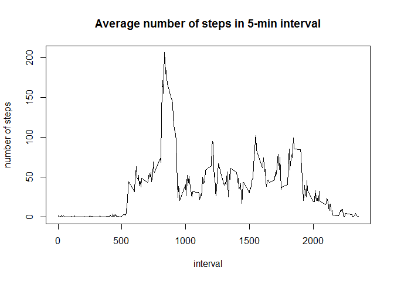
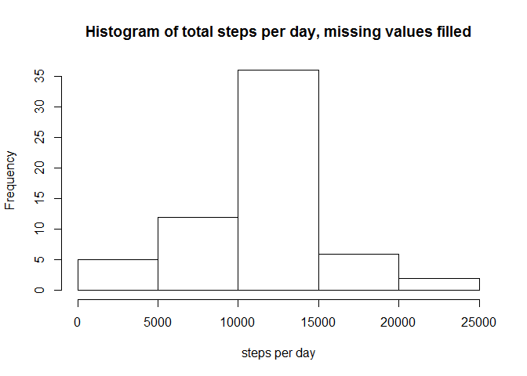
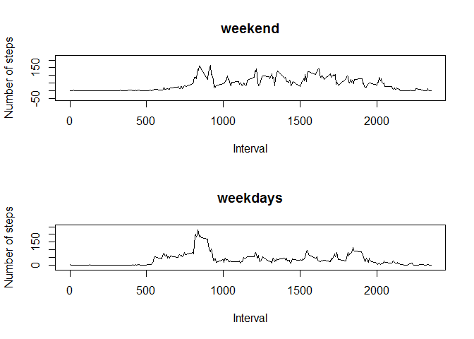
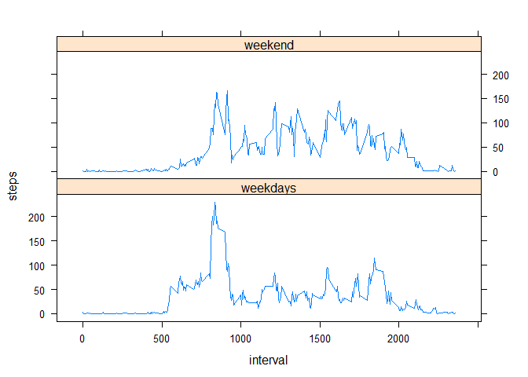

# Reproducible Research: Peer Assessment 1


## Loading and preprocessing the data


```r
activity_data<-read.csv('activity.csv', colClasses=c("numeric", "character", "integer"))
summary(activity_data)
```

```
##      steps            date              interval     
##  Min.   :  0.00   Length:17568       Min.   :   0.0  
##  1st Qu.:  0.00   Class :character   1st Qu.: 588.8  
##  Median :  0.00   Mode  :character   Median :1177.5  
##  Mean   : 37.38                      Mean   :1177.5  
##  3rd Qu.: 12.00                      3rd Qu.:1766.2  
##  Max.   :806.00                      Max.   :2355.0  
##  NA's   :2304
```

## What is mean total number of steps taken per day?

Now we calculate total number of steps  


```r
day_steps<-tapply(activity_data$steps, activity_data$date, sum, na.rm=TRUE)
```

Here is the histogram:  

```r
hist(day_steps, main="Histogram of total steps per day", xlab="steps per day")
```

 


```r
mean_day_steps<-mean(day_steps)
median_day_steps<-median(day_steps)
```

Mean steps per day is 9354.2295082, median is 1.0395\times 10^{4}:

## What is the average daily activity pattern?

Average number of steps per interval between days:


```r
ave_steps<-tapply(activity_data$steps, activity_data$interval, mean, na.rm=TRUE)
```

Activity pattern:


```r
plot(names(ave_steps), ave_steps, type='l', main='Average number of steps in 5-min interval', xlab='interval', ylab='number of steps')
```

 


```r
max_step_interval<-as.integer(names(which.max(ave_steps)))
```
Interval 835 contains maximum average number of steps.


## Inputing missing values


```r
total_na<-sum(is.na(activity_data$steps))
```

Total number of missing values is 2304.  
Now we use mean for that interval to fill missing values.


```r
# create vector of average values for each interval
ave_int<-sapply(activity_data$interval, function(x) { ave_steps[as.character(x)] })
# create new data set
nomiss_data<-activity_data
# fill missing values
nomiss_data$steps[is.na(activity_data$steps)] <- ave_int[is.na(activity_data$steps)]
# steps per day
nomiss_day_steps<-tapply(nomiss_data$steps, nomiss_data$date, sum)
nomiss_mean<-mean(nomiss_day_steps)
nomiss_median<-median(nomiss_day_steps)
```

Histogram:


```r
hist(nomiss_day_steps, main="Histogram of total steps per day, missing values filled", xlab="steps per day")
```

 

Mean steps per day: don't fill missing values: 9354.2295082, fill missing values: 1.0766189\times 10^{4}    

Median steps per day: don't fill missing values: 1.0395\times 10^{4}, fill missing values: 1.0766189\times 10^{4}  


## Are there differences in activity patterns between weekdays and weekends?

Now we create new factor in our dataset to indicate weekday or weekend:


```r
# function to discriminate
is_we<-function(x) { if (weekdays(as.Date(x))=="Saturday" || weekdays(as.Date(x))=="Sunday") as.factor("weekend") else as.factor("weekday") }
# apply to dataset and create new factor variable
suppressWarnings(nomiss_data$is_weekend<-sapply(nomiss_data$date, is_we))
# average by weekend
ave_steps_weekend<-tapply(nomiss_data$steps[nomiss_data$is_weekend=="weekend"], nomiss_data$interval[nomiss_data$is_weekend=="weekend"], mean, na.rm=TRUE)
#average by weekday
ave_steps_weekday<-tapply(nomiss_data$steps[nomiss_data$is_weekend=="weekday"], nomiss_data$interval[nomiss_data$is_weekend=="weekday"], mean)
```

And plot weekdays and weekend average:


```r
par(mfcol=c(2,1))
plot(as.integer(names(ave_steps_weekend)), ave_steps_weekend, asp=1, type='l', main='weekend', xlab='Interval', ylab='Number of steps')

plot(as.integer(names(ave_steps_weekday)), asp=1, ave_steps_weekday, type='l', main='weekdays', xlab='Interval', ylab='Number of steps')
```

 

Draw the same using lattice package:


```r
library(lattice)

data_ave_steps<-data.frame(interval=c(as.integer(names(ave_steps_weekend)), as.integer(names(ave_steps_weekday))) , steps=c(ave_steps_weekend, ave_steps_weekday), wd=c(rep("weekend",length(ave_steps_weekend) ),rep( "weekdays",length(ave_steps_weekday))))

xyplot(steps ~ interval | wd, data=data_ave_steps, layout=c(1,2), panel=function(x, y, ...){ panel.lines(x,y,...)})                     
```

 

We can see that there is a difference between weekday and weekend activity patterns - we observe greater mid-day activity on weekend.
